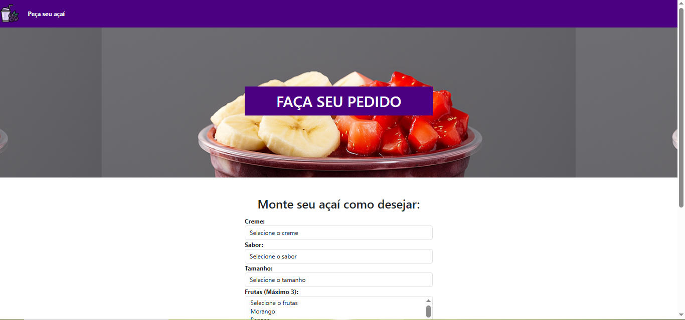
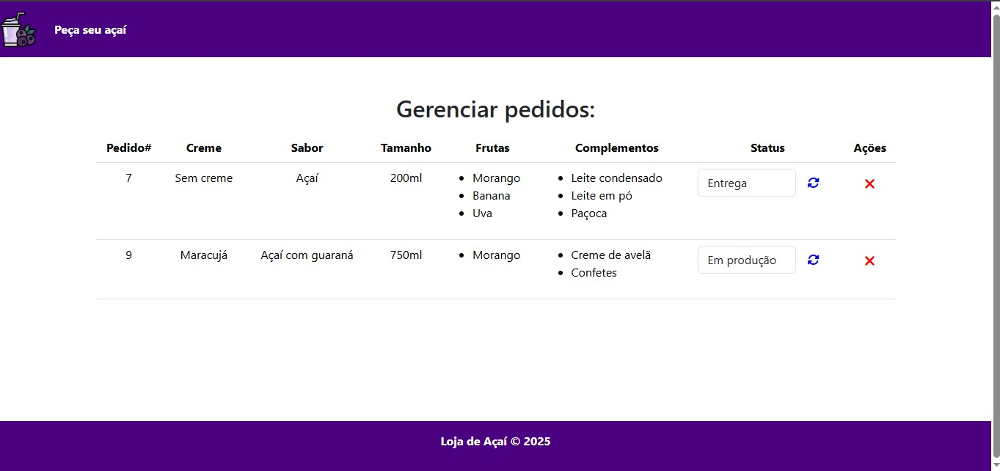

# Projeto loja açaí
>Sistema de gerenciamento para uma loja de açaí, com funcionalidades de cadastro, controle de pedidos, visualização de relatórios e interface amigável.

Este projeto foi desenvolvido com o objetivo de facilitar a administração de uma loja de açaí, permitindo o controle eficiente de pedidos, produtos e clientes, além de fornecer uma visualização de dados em tempo real através de um dashboard intuitivo. É uma aplicação web simples, ideal para pequenas empresas que desejam digitalizar seu atendimento.

 
 

## Instalação

#### MacOs X & Linux

```sh
git clone https://github.com/gluna777/projeto_loja_acai.git
cd projeto_loja_acai
npm install
npm run dev
```

#### Windows 
```sh
git clone https://github.com/gluna777/projeto_loja_acai.git
cd projeto_loja_acai
npm install
npm run dev

```

## Funcionalidades

* Cadastro de produtos e adicionais.
* Registro de pedidos com tamanho e adicionais.
* Dashboard com estatísticas e controle de pedidos.
* Estilização com CSS puro e layout responsivo.

## Ambiente de desenvolvimento
Pré-requisitos
* Servidor local (ex: XAMPP ou WAMP)

* MySQL (Workbench ou outro gerenciador)

* Navegador web

Passos
1. Clone o repositório:
```sh
git clone https://github.com/gluna777/projeto_loja_acai.git
```

2. Mova a pasta do projeto para o diretório htdocs (no caso do XAMPP).

3. Importe o arquivo .sql (se houver) no MySQL Workbench para criar o banco de dados.

4. Atualize as credenciais de conexão com o banco no arquivo PHP responsável pela conexão.

5. Inicie o servidor Apache e o MySQL.

6. Acesse o projeto no navegador:
```sh
http://localhost/projeto_loja_acai
```

## Autor
Gustavo Luna Procopio

Email: [gugalunaprocopio@gmail.com](gugalunaprocopio@gmail.com)

Linkedin:[gustavo-luna-procopio-tec](https://www.linkedin.com/in/gustavo-luna-procopio-tec/)